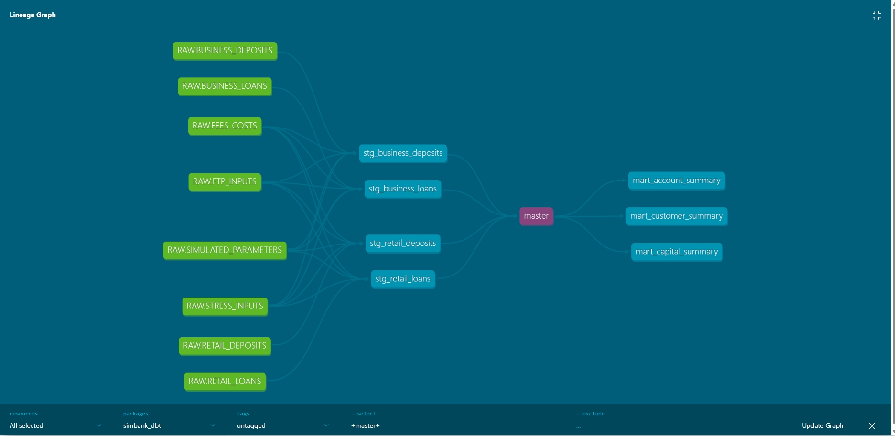
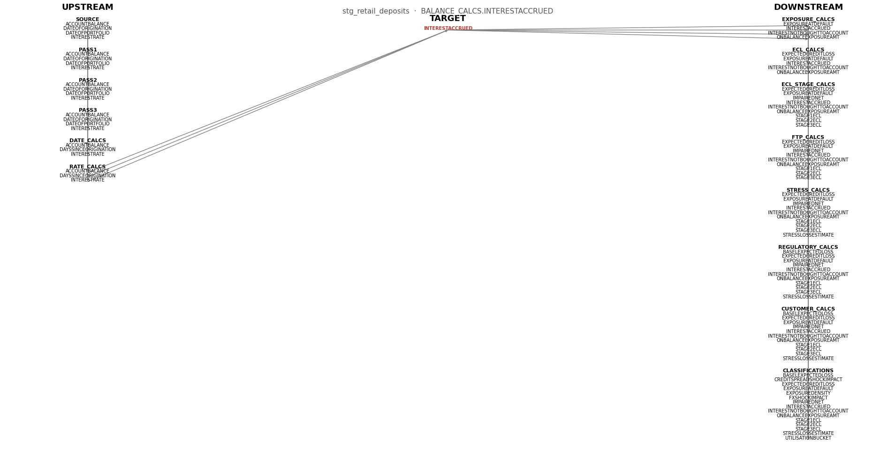

# SimBank — Synthetic Banking Data Platform

**Author:** Ross K
**Version:** 2.0 (see origin story below)
**Stack:** Python · dbt · Snowflake · sqlglot · LightGBM · PyTorch · Scikit-learn


-----

## Quick Summary

SimBank is a synthetic Australian banking platform build to demonstrate production-grade analytics engineering.

- **Python** generates 500k-1M realistic banking records across 4 account types 
- **dbt + Snowflake** transforms them through a governed pipeline (4 staging models, 3 marts, ~160 fields)
- **sqlglot** extracts field-level lineage automatically - 5,800+ lineage rows, bi-directional, queryable
- **networkx** renders lineage graphs showing upstream dependencies and downstream impacts for every field
- **V4 governance layer** adds code drift, data drift, docs drift, human approval gates and audit trails
- **Published dbt docs** are versioned, hashed, approved and stored with full lineage context

**Bi‑directional lineage lets you:**
- Update a field’s transformation and instantly see every downstream field impacted by the change.
- Trace a broken dashboard field back through every upstream calculation to find the exact source of failure.
- Troubleshoot data issues by revealing both what a field depends on and what depends on it.

**Governance layer shows:**
- Code drift detects any change to SQL logic and requires human approval before transformations can change.
- Data drift compares current Snowflake tables to approved baselines to ensure no unexpected changes enter the pipeline.
- Docs drift tracks meaningful dbt documentation changes and only updates published docs when approved.

Built because real banking data was off limits. Everything in it reflects seven years inside Australian financial data.

**github.com/PatternForge/Simbank**
-----

## What Is SimBank?

SimBank is a synthetic banking data platform that generates realistic, APRA-aligned banking portfolio data for analytics engineering development, model sandboxing, and data pipeline testing.

Each run produces between **500,000 and 1,000,000 rows** across **160 banking domain fields** in under 60 seconds — randomised by design to ensure every execution produces a unique portfolio snapshot, mimicking the natural variation of a real banking book.

This is not tutorial data. It is not randomly generated noise dressed up as banking data. Every field, every distribution, every relationship between variables reflects how a real Australian banking portfolio actually behaves.

-----

## Why Does This Exist?

I spent seven years as a data analyst at an Australian bank feeding APRA regulatory models — capital adequacy, ECL provisioning, liquidity stress testing, funds transfer pricing. I understood the data deeply. I wanted to build on top of it, experiment with modern tooling, and develop analytics engineering skills.

There was one problem: Python was blocked on production systems for legitimate security reasons. Real customer data was off limits. I couldn’t touch the actual environment.

So I built my own.

SimBank started as a single Python script — `SyntheticBank.py`, still included in this repository as a record of where it began. Over time it evolved into a fully modular Python package with a proper pipeline architecture, ML layer, and capital stress testing engine.

The constraints that created SimBank are the same constraints that exist in every mature financial institution. The response to those constraints is what this project is actually about: when you can’t use the real thing, build something better.

-----

## The Governance Story

Simbank started as a way to learn dbt and Snowflake. It became something more important.

During modularisation of the Python data generation layer, AI-assisted code introduced a silent calculation error.  Interest Accrued was being calculated using an incorrect formula - Balance x Rate x Term / 12 / 12.  This propagated without triggering any errors through downstream dependent fields like EAD, OnBalanceExposure, FundingCost.

The mistake was only caught during the dbt rebuild, when every field was being rewritten from scratch, and interrogated individually against the Python source.

This is the problem Simbank is now designed to solve.  Without field lineage, validation frameworks and human control layers, errors introduced by AI-assisted code are invisible until someone looks closely enough.

Simbank is built to be that someone.

The governance architecture that emerged from this has a broader application. The same principles that make banking data trustworthy are the same principles that make AI systems trustworthy.  Lineage, controls, human approval, audit trails and strict separation between the AI layer and the validation layer.  That connection is what V3 through V5 is building towards.

-----

## The Origin Story — SyntheticBank.py

`SyntheticBank.py` is included in this repository intentionally. It is the original monolithic script — approximately 1,000 lines, sequential, no separation of concerns — that preceded the SimBank package.

It is here for two reasons:

First, transparency. Every project starts somewhere and pretending otherwise serves nobody.

Second, contrast. Reading `SyntheticBank.py` and then looking at the SimBank package architecture tells a story about how an engineer thinks about refactoring, modularity and maintainability. The domain logic is identical. The structure is not.

-----

## What SimBank Generates

### Account Types

- Retail Loans
- Retail Deposits
- Business Loans
- Business Deposits

### Domain Fields — 160 Total

**Core Account Attributes:**
Account identifiers, account type, source system, portfolio date, customer linkage

**Balances & Market Values:**
Account balance with correct asset/liability sign conventions, market value, account principal, available balance, limit, advance amounts

**Dates:**
Origination date, settlement date, maturity date, days since settlement, days since origination, days until maturity — all constrained by borrower age and product type

**Credit Risk:**
LVR, LVR bands, LMI flag, collateral category, arrears amount, arrears days, provisions, impaired flag, defaulted exposure class

**Capital Adequacy (APRA-aligned):**
Exposure at default, exposure class, exposure group, exposure sub-class, risk weight, risk weighted assets (on and off balance), capital charge, capital buffer, regulatory asset class, Basel expected loss, regulatory PD, regulatory LGD

**ECL & IFRS9:**
PD, LGD, ECL, Stage 1/2/3 classification, stage-level PD/LGD/ECL, impaired net

**Funds Transfer Pricing:**
Base rate, addon rate, basis cost, liquidity rate, transfer rate, transfer spread, funding index, funding cost rate, liquidity premium, expected return

**Amortisation:**
Amortisation type (P&I, Interest Only, Bullet), monthly repayment, term, daily/monthly/annual rates

**Affordability:**
Monthly income, annual income, loan to income, estimated living expenses, net disposable income, affordability flag, debt service ratio

**Liquidity & Stress Testing:**
Liquidity bucket, stable funding flag, interest rate shock impact, credit spread shock impact, FX shock impact, stress adjusted PD/LGD, stress scenario flag, stress loss estimate, withdrawal risk, macro volatility index

**Customer & Portfolio:**
Customer tier, customer risk segment, portfolio segment, industry sector, cross-sell flag, group exposure rank, relationship length, vintage, geographic region, currency

**Profitability:**
RAROC, funding cost, fees charged, operational cost, interest accrued

-----

V2 - dbt/Snowflake Transformation Layer

Simbank V2 loads the four source files into a Snowflake RAW schema and transforms them through a governed dbt pipeline.

**Staging Models:**

1. stg_retail_deposits - 15 CTEs, ~ 130 fields
2. stg_retail_loans - 15 CTEs, ~ 160 fields
3. stg_business_deposits - 15 CTEs, ~ 130 fields
4. stg_business_loans - 15 CTEs, ~ 160 fields
5. master - UNION ALL across all four models, ~160 fields, between 500k - 1million records

**Transformation layers per models:**

SOURCE > SIMULATED_PARAMS > PASS1-3 > DATE_CALCS > RATE_CALCS  > BALANCE_CALCS > EXPOSURE_CALCS > ECL_CALCS > ECL_STAGE_CALCS > FTP_CALCS > STRESS_CALCS > REGULATORY_CALCS > CUSTOMER_CALCS > CLASSIFICATIONS

Each staging model follows the same consistent CTE waterfall architecture. Fields are grouped by logical domain rather than defined one-per-line. Aliases are consistent. The structure is intentional.

-----

## V3 - dbt Lineage Graph




-----

## V3 - Field-Level Lineage Extractor

SimBank includes a fully automated field-level lineage extractor built on sqlglot and networkx.  It parses compiled dbt SQL, resolves wildcard expansions dynamically against Snowflake's INFORMATION_SCHEMA, and produces bi-directional field lineage across every CTE in every model.



**What it does:**
- Parses every staging model SQL file using sqlglot
- Resolves 'SELECT P.*' wildcard expansions by queriying Snowflake column metadata dynamically
- Traces every field forward (what does this field feed into?) and backward (where does this field come from?)
- Produces 5,800+ lineage rows across all four staging models in a single run
- Renders bi-directional lineage graphs showing upstream dependencies and downstream impact

**Usage:**

# Interactive mode - select model, CTE and field
python simbank_dbt/lineage/run_lineage.py

# Dump all models to CSV
python simbank_dbt/lineage/run_lineage.py

# Trace a specific field directly
python simbank_dbt/lineage/run_lineage.py

# NOTE: This requires an .env file in the root folder
SNOWFLAKE_USER=your_user
SNOWFLAKE_PASSWORD=your_password
SNOWFLAKE_ACCOUNT=your_account
-----

## V4 — Governance, Drift Detection & Human Approval
SimBank V4 introduces a full governance layer across the entire dbt/Snowflake pipeline.
Every execution is validated, compared to baselines, and routed through human approval gates before anything is published.

**What V4 Adds**
1. Code Drift Detection  
All SQL models are hashed and compared to the last approved baseline.
If nothing changed, the pipeline proceeds.
If code changed, a Slack review is triggered and human approval is required.

2. Data Drift Detection  
All four source tables are compared against their approved baseline snapshots.
Row counts, schema, field manifests and combined dataset hashes are validated.
If the data changed unexpectedly, the run is halted until reviewed.

3. Documentation Drift Detection  
dbt docs are generated on every run and compared to the last approved docs baseline.
SimBank uses a meaningful‑content hash that only changes when YAML‑defined documentation changes.
If code hasn’t changed, docs drift is automatically suppressed.

4. Approval Gates  
Each drift detector writes a result file and posts a Slack message.
The pipeline pauses until a human approves the change.
Approved baselines are written to Snowflake and versioned locally.

5. Published Documentation  
After approval, dbt docs are published to a versioned folder and indexed.
Each run produces a permanent, auditable snapshot of the documentation.

6. Full Audit Trail  
Every run produces:
run ID, 
timestamp, 
drift status, 
baseline hash, 
approved hash, 
reviewer, 
published docs version

All stored in Snowflake under the GOVERNANCE schema.

**How to run V4**

_Run the full V4 governance workflow_
- python run_v4.py

-----

## Architecture

```
SimBank/
├── generators/          # Core data generation
│   ├── base_snapshot.py # Account creation, IDs, types
│   ├── linkages.py      # Customer-account relationships, offset linking
│   └── collateral.py    # Collateral categories and property types
│
├── features/            # Domain calculations
│   ├── amortization.py  # P&I, IO, Bullet repayment logic
│   ├── arrears_provision.py  # Arrears, provisions, impairment
│   ├── exposures.py     # EAD, on/off balance, credit conversion
│   ├── ftp_rates.py     # Transfer pricing components
│   ├── regulatory.py    # RWA, capital, APRA fields
│   ├── ecl.py           # IFRS9 ECL staging and calculation
│   ├── portfolio_enrichment.py  # Segmentation, enrichment
│   ├── profitability.py # RAROC, funding cost, fees
│   ├── stress.py        # Stress testing scenarios
│   └── backfill_original.py
│
├── models/              # ML layer (see note on leakage below)
│   ├── pd_model.py      # Probability of default
│   ├── lgd_model.py     # Loss given default
│   ├── ead_model.py     # Exposure at default
│   ├── raroc_model.py   # Risk adjusted return on capital
│   ├── staging_classifier.py  # IFRS9 stage classification
│   ├── anomaly_detector.py    # Portfolio anomaly detection
│   ├── customer_segmentation.py  # Customer clustering
│   └── advanced_pack.py # LightGBM + Neural Network models
│
├── validators/          # Data quality
│   ├── schema.py        # Required column validation
│   └── business_rules.py  # LVR bounds, sign conventions
│
├── utils/               # Shared utilities
│   ├── seed.py          # RNG management
│   ├── perf.py          # Performance timing
│   └── dtype.py         # Type optimisation
│
├── pipeline.py          # Orchestration
├── config.py            # Configuration
├── main.py              # Entry point
└── __main__.py
```

-----

## ML Layer

SimBank includes a machine learning layer that trains models on the generated portfolio data.

### Models

- **PD Model** — Probability of Default (R² 1.00 — see leakage note)
- **LGD Model** — Loss Given Default (R² 0.92)
- **EAD Model** — Exposure at Default (R² 0.99)
- **RAROC Model** — Risk Adjusted Return on Capital (R² 0.998)
- **Staging Classifier** — IFRS9 Stage 1/2/3 (F1 1.00 — see leakage note)
- **Anomaly Detector** — Portfolio anomaly flagging (17 features, top 1% flagged)
- **Customer Segmentation** — K-means clustering (6 segments)
- **Advanced Pack** — LightGBM Stage 3 default prediction (AUC 0.9938) + Neural Network (AUC 0.9974)

### Important Note on Data Leakage

The ML models in SimBank are trained on synthetic data generated by known mathematical relationships. Near-perfect R² scores on some models reflect this — a PD model trained on CreditScore-derived PD values will achieve near-perfect fit by design because it is learning the formula back.

This is intentional and acknowledged. The purpose of the ML layer is architectural demonstration — showing how credit risk models slot into a data pipeline — not predictive validity. Real-world deployment would require training on historical observed defaults with proper train/test splits across time.

The anomaly detector, customer segmentation and balance forecasting models are less affected by this and produce more genuinely informative outputs.

-----

## Capital Stress Testing Engine

SimBank includes a capital engine that produces regulatory capital outputs across stress scenarios:

```
=== Base Scenario ===
Total RWA: $455,691,800 | Required Capital: $47,847,640 | CET1: 14.26% | Tier 1: 17.56% | Total Capital Ratio: 19.75%

=== Mild Stress Scenario ===
Total RWA: $501,261,000 | Required Capital: $52,632,404 | CET1: 12.97%
```

Provides APRA-aligned stress outputs for multiple scenarios.

-----

## How To Run

```bash
# Clone the repository
git clone https://github.com/PatternForge/SimBank.git
cd SimBank

# Create virtual environment
uv venv .venv
.venv\Scripts\activate  # Windows
source .venv/bin/activate  # Mac/Linux

# Install dependencies
uv pip install -r requirements.txt

# Run SimBank
python -m SimBank
```

Each run generates a unique portfolio snapshot. Expect 500,000 to 1,000,000 rows across 160 fields in under 60 seconds.

-----

## What’s Next

**v2 — Complete:**

Four source file extracts loaded into Snowflake and transformed through a governed dbt pipeline.  Full staging layer across all four account types with consistent 15-CTE waterfall architecture.

**v3 — Complete:**

sqlglot parsing, FIELD_LINEAGE table, visual lineage graph, bi-directional (forward/backward) queryable.  Pure Lineage

**v4 — Complete:**

Automated docs generated on every dbt run, drift detection against baselines, human approval workflows, audit trail.  The full governance layer.

**v5 — LLM Governance Layer**  
Introduce an LLM interface with hallucination, bias and response‑validation controls, ensuring outputs are traceable to underlying data and lineage.

**v6 — Automated Governance Orchestration**
Unify lineage, drift detection, and LLM validation into a single automated control framework across the pipeline.

**v7 — Governance Observability**
Dashboards providing visibility into lineage, drift events, approvals, and system health across all models.

**v8 — Interactive Data Governance Assistant**
Extend the LLM interface into a controlled assistant capable of answering analytical and lineage questions with full traceability and auditability.
-----

## Requirements

```
pandas
numpy
scipy
lightgbm
torch
scikit-learn
```

-----

*SimBank was built because the real thing was off limits. Everything in it reflects seven years of working inside Australian banking data. The constraints were real. The response to them is this.*
