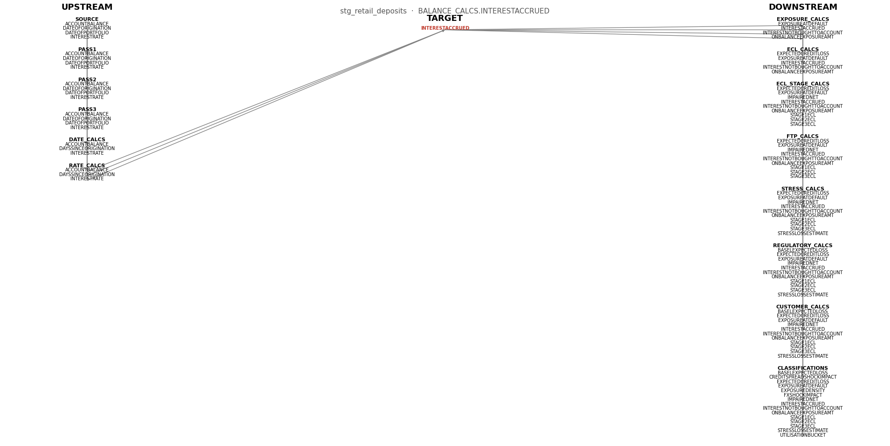

# SimBank — Trust-First Analytics Engineering Platform  

**I'm an Analytics Engineer who builds data systems that stay honest under pressure.**

SimBank is the infrastructure that came out of learning, the hard way, that AI-assisted pipelines can fail silently — and that the answer isn't better testing. It's better governance.

**SimBank is a trust‑first platform — built to catch what testing, monitoring, and AI‑assisted development all miss.**

---

## The Incident That Built This

During a modularisation of the data generation layer, AI-assisted code introduced a silent calculation error:

```python
# AI-generated — syntactically correct, semantically wrong
Interest_Accrued = Balance * Rate * Term / 12 / 12   # double division

# Correct
Interest_Accrued = Balance * Rate * (DaysSinceSettlement / 365)
```

The formula compiled. The values looked plausible. Tests passed. The error propagated silently through `EAD`, `OnBalanceExposure`, and `FundingCost` until a manual field-by-field rebuild caught it.

**The problem wasn't the AI. The problem was a system with no way to catch what testing misses.**

SimBank is the engineered response to that failure mode.

---

## What SimBank Is

A fully orchestrated, end-to-end analytics engineering platform built on synthetic banking data.

It demonstrates how to build data systems where:

- Every field dependency is traceable in both directions
- Drift in code, data, or documentation is detected and flagged before deployment
- Nothing propagates without human approval
- Every approval is recorded with who, when, what drifted, and what was affected
- AI can assist — but cannot modify its own controls

**This is a governance architecture that applies to any pipeline where AI is writing production code.**

---

## Architecture
*Full V6 pipeline: Python generation → dbt transformation → lineage extraction → drift detection → approval gates → docs publishing → governance dashboard*


---

### Bi-Directional Lineage
*Trace any field forward (what breaks if I change this?) or backward (what caused this to break?)*



---

---

## What This Demonstrates

- Structured, reproducible transformations with consistent modelling patterns
- Bi-directional field-level lineage: *what breaks if I change this?* and *what caused this to break?*
- Three-layer drift detection across code, data, and documentation
- Human-in-the-loop approval gates with full audit trail
- AI-assisted schema design, validated end-to-end
- Read-only LLM governance interface (V7 — in development): query governance state, hallucination-safe responses grounded strictly in lineage + drift data, LLM cannot mutate governance state
- Adversarial testing framework (V8 — planned): stress-test the governance engine itself
- Independent assurance layer (V10 — planned): cross-validates governance outputs for consistency

**SimBank is a trust-first platform — built to catch what testing, monitoring, and AI-assisted development all miss.**

---

## Roadmap

| Version | Status | What it adds |
|---|---|---|
| V1 — Data Generation | ✅ Deployed | Synthetic banking data, 160 fields |
| V2 — dbt Transformation | ✅ Deployed | Governed CTE waterfall |
| V3 — Field-Level Lineage | ✅ Deployed | 5,800+ bi-directional dependencies |
| V4 — Drift Detection & Approval Gates | ✅ Deployed | Human-in-the-loop governance |
| V5 — Full Orchestration | ✅ Deployed | Single-command end-to-end pipeline |
| V6 — Governance Dashboard | ✅ Current | Impact analysis, root cause, system health |
| V7 — LLM Query Interface | 🔨 In development | Natural language governance queries — read-only, hallucination-controlled |
| V8 — Adversarial Testing | 📋 Planned | Stress-test governance under failure conditions |
| V9 — Governance Explainability | 📋 Planned | Plain-language lineage and drift narratives |
| V10 — Independent Assurance Layer | 📋 Planned | Cross-validates governance outputs for consistency |

---
### Quick Start (5 lines)

1. Create `.env` from `.env.example`
2. Activate virtual environment
3. `pip install -r requirements.txt`
4. `python Orchestrator/run.py`
5. Approve drift gates when prompted

--- 

<details>
<summary><h2>Quick Start (detailed)</h2></summary>

#### Prerequisites
- Python 3.9+
- Snowflake account (or run in demo mode)
- Slack webhook (optional, for approval notifications)

#### Setup

```bash
# 1. Clone repository
git clone https://github.com/PatternForge/SimBank.git
cd SimBank

# 2. Create virtual environment
python -m venv .venv
source .venv/bin/activate  # Mac/Linux
.venv\Scripts\activate     # Windows

# 3. Install dependencies
pip install -r requirements.txt

# 4. Configure environment
cp .env.example .env
# Edit .env with your Snowflake credentials:
#   SNOWFLAKE_ACCOUNT=your_account
#   SNOWFLAKE_USER=your_user
#   SNOWFLAKE_PASSWORD=your_password
#   SLACK_WEBHOOK_URL=your_webhook (optional)
```

#### Run the Full Pipeline

```bash
# Run the complete V6 governance workflow
python -m Orchestrator.run

# Follow the prompts:
# - Code drift detection → review → approve
# - Data drift detection → review → approve  
# - Docs drift detection → review → approve → publish
```

**What happens:**
1. Python generates 500k-1M banking records across four account types
2. dbt transforms them through 8 models
3. Lineage extractor writes 5,800+ field dependencies to Snowflake
4. Drift detectors compare current state to approved baselines
5. Slack notifications sent for review
6. Pipeline pauses at approval gates
7. After approval, baselines updated and docs published

**Time:** ~4 minutes end-to-end


#### Launch the Governance Dashboard

```bash
streamlit run Dashboard/app.py
```


</details>

--- 

<details>
<summary><h2>Background Story — Why This Exists</h2></summary>

I spent seven years as an Analytics Engineer / Data Analyst at an Australian bank feeding APRA regulatory models — capital adequacy, ECL provisioning, liquidity stress testing, funds transfer pricing.

Python was blocked on production systems. Real customer data was off-limits. So I built a synthetic environment that behaves like the real thing: same distributions, same edge cases, same structural constraints — no customer data, no regulatory risk.

The governance layer wasn't planned. It emerged from the incident above. Once the problem became visible — that AI-generated code can be syntactically valid, semantically wrong, and completely invisible to standard testing — the architecture followed naturally.

The same principles that make banking data trustworthy are the same principles that make AI systems trustworthy. That's what SimBank demonstrates.

</details>

---

<details>
<summary><h2>Technical detail — data generation, dbt, lineage, governance layers</h2></summary>

### Data Generation Layer (Python)
SimBank/
├── generators/          # Core data generation
│   ├── base_snapshot.py # Account creation, IDs, types
│   ├── linkages.py      # Customer-account relationships
│   └── collateral.py    # Collateral categories
│
├── features/            # Domain calculations
│   ├── amortization.py  # P&I, IO, Bullet repayment
│   ├── arrears_provision.py  # Arrears, provisions, impairment
│   ├── exposures.py     # EAD, on/off balance exposure
│   ├── regulatory.py    # RWA, capital, APRA fields
│   ├── ecl.py           # IFRS9 ECL staging
│   ├── ftp_rates.py     # Transfer pricing
│   ├── profitability.py # RAROC, funding cost
│   └── stress.py        # Stress testing scenarios
│
├── models/              # ML layer
│   ├── pd_model.py      # Probability of default
│   ├── lgd_model.py     # Loss given default
│   ├── ead_model.py     # Exposure at default
│   ├── raroc_model.py   # Risk-adjusted return
│   ├── staging_classifier.py  # IFRS9 stage classification
│   ├── anomaly_detector.py    # Portfolio anomaly detection
│   └── customer_segmentation.py
│
├── validators/          # Data quality
│   ├── schema.py        # Column validation
│   └── business_rules.py  # LVR bounds, sign conventions
│
└── pipeline.py          # Orchestration

**Output:** 4 CSV files (Retail Loans, Retail Deposits, Business Loans, Business Deposits)  
**Performance:** 500k-1M records, 160 fields, <60 seconds

### Transformation Layer (dbt)
models/
├── staging/
│   ├── stg_retail_deposits.sql    # 15 CTEs, ~130 fields
│   ├── stg_retail_loans.sql       # 15 CTEs, ~160 fields
│   ├── stg_business_deposits.sql  # 15 CTEs, ~130 fields
│   └── stg_business_loans.sql     # 15 CTEs, ~160 fields
│
├── master.sql                      # UNION ALL, ~160 fields
│
└── marts/
├── mart_account_summary.sql
├── mart_capital_summary.sql
└── mart_customer_summary.sql

**CTE Waterfall (consistent across all staging models):**
SOURCE → SIMULATED_PARAMS → PASS1-3 → DATE_CALCS → RATE_CALCS →
BALANCE_CALCS → EXPOSURE_CALCS → ECL_CALCS → ECL_STAGE_CALCS →
FTP_CALCS → STRESS_CALCS → REGULATORY_CALCS → CUSTOMER_CALCS →
CLASSIFICATIONS

### Lineage Layer (sqlglot + networkx)

- Parses compiled dbt SQL using sqlglot
- Resolves `SELECT *` wildcards by querying Snowflake `INFORMATION_SCHEMA`
- Traces every field forward (downstream impacts) and backward (upstream dependencies)
- Produces 5,800+ bi-directional lineage rows
- Writes to `FIELD_LINEAGE` table in Snowflake
- Renders visual lineage graphs via networkx

### Governance Layer

**Drift Detectors:**
- **Code Drift** — Hash all SQL models, compare to approved baseline
- **Data Drift** — Compare row counts, schema, field manifests, combined dataset hash
- **Docs Drift** — Hash YAML-defined documentation, suppress mechanical changes

**Approval Gates:**
- Each drift detector posts to Slack
- Pipeline pauses until human presses ENTER
- Approval recorded with: run_id, timestamp, approved_by, drift_magnitude, affected_fields

**Audit Trail (Snowflake GOVERNANCE schema):**
- `CODE_BASELINE` — Approved SQL hashes by run_id
- `DATA_ATTESTATION` — Approved data snapshots by run_id
- `DOCS_BASELINE` — Approved documentation hashes by run_id
- `FIELD_LINEAGE` — 5,800+ bi-directional field dependencies
- `FIELD_CATALOG` — Field metadata and definitions
- `FIELD_HEALTH` — Field status (HEALTHY/BROKEN)
- `FIELD_CHANGE_DIFF` — Open drift events

### Dashboard Layer (Streamlit)

**Impact Analysis:**
- Select any field
- See all downstream dependencies
- Analyze impact before deploying changes

**Root Cause Analysis:**
- Select any broken field
- Trace back through upstream dependencies
- Find the exact source of failure

**System Health:**
- Field health percentage
- Broken field count
- Open drift event count

</details>

---
<details>
<summary><h2>ML Layer</h2></summary>

SimBank includes a machine learning layer that trains models on the generated portfolio data.

**Models:**
- **PD Model** — Probability of Default (R² 1.00)
- **LGD Model** — Loss Given Default (R² 0.92)
- **EAD Model** — Exposure at Default (R² 0.99)
- **RAROC Model** — Risk-Adjusted Return on Capital (R² 0.998)
- **Staging Classifier** — IFRS9 Stage 1/2/3 (F1 1.00)
- **Anomaly Detector** — Portfolio anomaly flagging (17 features, top 1% flagged)
- **Customer Segmentation** — K-means clustering (6 segments)
- **Advanced Pack** — LightGBM Stage 3 default prediction (AUC 0.9938) + Neural Network (AUC 0.9974)

**Important Note on Data Leakage:**

The ML models are trained on synthetic data generated by known mathematical relationships. Near-perfect R² scores reflect this — a PD model trained on CreditScore-derived PD values will achieve near-perfect fit by design because it's learning the formula back.

This is **intentional and acknowledged**. The purpose of the ML layer is **architectural demonstration** — showing how credit risk models slot into a data pipeline — not predictive validity.

Real-world deployment would require training on historical observed defaults with proper train/test splits across time.

The anomaly detector, customer segmentation, and balance forecasting models are less affected by this and produce more genuinely informative outputs.

</details>

---

<details>
<summary><h2>Live Demo — Full V6 Workflow</h2></summary>

Here's what happens when you run `python Orchestrator/run.py`:

### Step 1: Data Generation (15 seconds)
INFO: pipeline 15.145s  
INFO: records 606609 fields 160  
✓ Source files written to sources/2026-04-27_14-12-42/

### Step 2: dbt Transformation (8 seconds)
Concurrency: 4 threads (target='dev')  
✓ 8/8 models completed successfully

### Step 3: Lineage Extraction (5 seconds)
Extracting 5 model(s)...  
✓ Successfully wrote 5815 rows to FIELD_LINEAGE

### Step 4: Code Drift Detection
Found baseline with 8 files  
✅ NO CODE DRIFT DETECTED

### Step 5: Data Drift Detection
RETAIL_DEPOSITS: ✓ STABLE (540,863 → 540,863, 0.0%)  
RETAIL_LOANS: ✓ STABLE (31,749 → 31,749, 0.0%)  
BUSINESS_DEPOSITS: ✓ STABLE (45,100 → 45,100, 0.0%)  
BUSINESS_LOANS: ✓ STABLE (19,042 → 19,042, 0.0%)  
Combined manifest hash: 5d58895b9a86...  
✅ NO DRIFT DETECTED

### Step 6: Docs Drift Detection
Baseline HASH: 79a51b6660a2...  
Current HASH: 79a51b6660a2...  
✅ NO DOCS DRIFT DETECTED

### Step 7: Human Approval Gates
✓ Code message posted to Slack  
✓ Data message posted to Slack  
✓ Docs review posted to Slack  
Press ENTER to approve and continue...  
[Human reviews, approves]

### Step 8: Publish & Commit
✓ Code baseline written to Snowflake  
✓ Data attestation written to Snowflake  
✓ Docs published to versioned folder  
✅ V6 Workflow Complete

**Total time:** ~4 minutes end-to-end.

</details>

---
<details>
<summary><h2>Requirements</h2></summary>

Core dependencies
pandas
numpy
scipy
snowflake-connector-python
python-dotenv
dbt
dbt-core
dbt-snowflake
Lineage & visualization
sqlglot
networkx
graphviz
ML layer
lightgbm
torch
scikit-learn
Dashboard
streamlit

</details>

---

*SimBank was built because the real thing was off-limits. Everything in it reflects seven years of working inside Australian banking data. The constraints were real. The response to them is this.*
