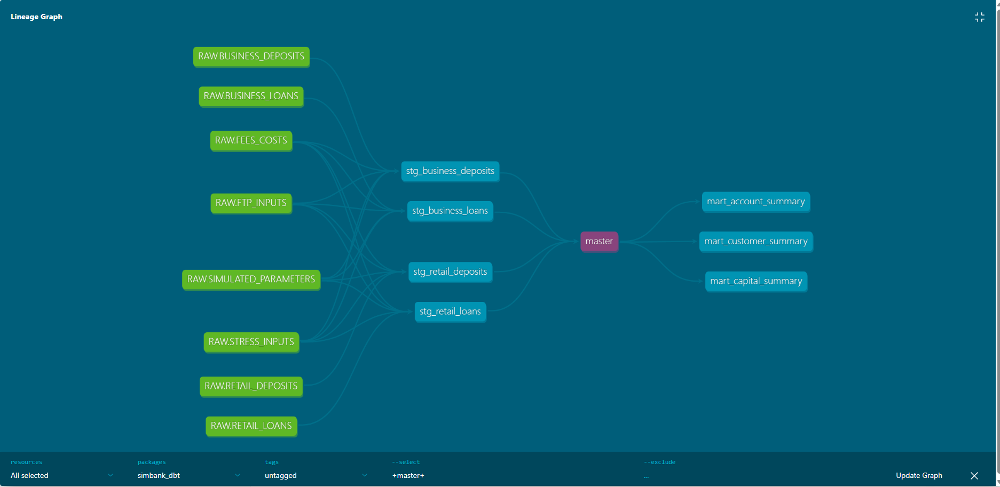

## SimBank — Proactive Analytics Engineering Platform
Synthetic Banking Data · Field-Level Lineage · Drift Detection · Governance Automation

**Author:** Ross K
**Version:** 6.0 (see origin story below)
**Stack:** Python · dbt · Snowflake · sqlglot · LightGBM · PyTorch · Scikit-learn

SimBank is **proactive governance infrastructure** for analytics engineering. Instead of reacting to broken dashboards, it prevents failures before deployment.

-----

### Architecture


*Full V6 pipeline: Python generation → dbt transformation → lineage extraction → drift detection → approval gates → docs publishing → governance dashboard*

---

### Bi-Directional Lineage


*Trace any field forward (what breaks if I change this?) or backward (what caused this to break?)*

---

### What This Does

SimBank is **proactive governance infrastructure** for analytics engineering. Instead of reacting to broken dashboards, it prevents failures before deployment.

**The shift:**
- **Reactive:** "The dashboard broke. Trace back through 47 fields to find the error."
- **Proactive:** "You're about to change LGD. Here are the 47 downstream fields that will be impacted. Review them now before deploying."

**Core capabilities:**
- **Impact Analysis** — Select any field, see every downstream dependency instantly
- **Root Cause Analysis** — Select any broken field, trace it back to the source
- **Drift Detection** — Code, data, and docs are hashed and compared to approved baselines
- **Human Approval Gates** — Nothing deploys without explicit sign-off
- **Full Audit Trail** — Every change, approval, and drift event stored in Snowflake

Proactive Analytics Engineering means detecting, explaining, and preventing failures before deployment — using lineage, drift detection, approvals, and explainability instead of waiting for dashboards to break.

**Built after AI-assisted code introduced a silent calculation error** that propagated through a regulatory pipeline undetected. The governance system that caught it is what you're looking at.

---
### Quick Start (5 lines)

1. Create `.env` from `.env.example`
2. Activate virtual environment
3. `pip install -r requirements.txt`
4. `python Orchestrator/run.py`
5. Approve drift gates when prompted

### Quick Start (detailed)

#### Prerequisites
- Python 3.9+
- Snowflake account (or run in demo mode)
- Slack webhook (optional, for approval notifications)

#### Setup

```bash
# 1. Clone repository
git clone https://github.com/PatternForge/SimBank.git
cd SimBank

# 2. Create virtual environment
python -m venv .venv
source .venv/bin/activate  # Mac/Linux
.venv\Scripts\activate     # Windows

# 3. Install dependencies
pip install -r requirements.txt

# 4. Configure environment
cp .env.example .env
# Edit .env with your Snowflake credentials:
#   SNOWFLAKE_ACCOUNT=your_account
#   SNOWFLAKE_USER=your_user
#   SNOWFLAKE_PASSWORD=your_password
#   SLACK_WEBHOOK_URL=your_webhook (optional)
```

#### Run the Full Pipeline

```bash
# Run the complete V6 governance workflow
python Orchestrator/run.py

# Follow the prompts:
# - Code drift detection → review → approve
# - Data drift detection → review → approve  
# - Docs drift detection → review → approve → publish
```

**What happens:**
1. Python generates 500k-1M banking records across four account types
2. dbt transforms them through 8 models
3. Lineage extractor writes 5,800+ field dependencies to Snowflake
4. Drift detectors compare current state to approved baselines
5. Slack notifications sent for review
6. Pipeline pauses at approval gates
7. After approval, baselines updated and docs published

**Time:** ~4 minutes end-to-end

#### Launch the Governance Dashboard

```bash
streamlit run Dashboard/app.py
```

**Dashboard views:**
- **Impact Analysis** — Select a field, see all downstream impacts before deploying a change
- **Root Cause Analysis** — Select a broken field, trace it back through upstream dependencies
- **System Health** — Field health %, broken field count, open drift events

---

<details>
<summary><h2>The Governance Story — Why This Exists</h2></summary>

SimBank started as a way to learn dbt and Snowflake. It became AI governance infrastructure.

**The incident:**

During modularization of the Python data generation layer, AI-assisted code introduced a silent calculation error:

```python
# Incorrect formula (AI-generated)
Interest_Accrued = Balance * Rate * Term / 12 / 12  # Wrong: double division

# Correct formula
Interest_Accrued = Balance * Rate * (DaysSinceSettlement / 365)
```

This propagated without errors through downstream fields: `EAD`, `OnBalanceExposure`, `FundingCost`. Traditional testing didn't catch it because the formula was syntactically correct and produced plausible values.

The error was only caught during manual dbt rebuild when every field was interrogated individually against the Python source.

**The problem:**

Without field lineage, validation frameworks, and human approval gates, **AI-generated errors are invisible until someone looks closely enough.**

**The solution:**

SimBank is now built to be that "someone":
- Bi-directional lineage traces every field dependency automatically
- Drift detection catches when code changes OR when outputs drift without code changes
- Human approval gates ensure nothing deploys without review
- Full audit trail makes every change traceable

The governance architecture that emerged has broader application: **the same principles that make banking data trustworthy are the same principles that make AI systems trustworthy.**

</details>

---

<details>
<summary><h2>Origin Story — SyntheticBank.py</h2></summary>

I spent seven years as a data analyst at an Australian bank feeding APRA regulatory models — capital adequacy, ECL provisioning, liquidity stress testing, funds transfer pricing.

**The constraint:** Python was blocked on production systems for security reasons. Real customer data was off-limits.

**The response:** Build a synthetic environment that mimics the real thing.

SimBank started as a single Python script — `SyntheticBank.py`, still included in this repository. Approximately 1,000 lines, sequential, no separation of concerns.

It's here for two reasons:

1. **Transparency** — Every project starts somewhere. Pretending otherwise serves nobody.
2. **Contrast** — Reading `SyntheticBank.py` and then looking at the current SimBank package architecture shows how an engineer thinks about refactoring, modularity, and maintainability. The domain logic is identical. The structure is not.

Over time, it evolved into:
- Fully modular Python package with proper pipeline architecture
- dbt transformation layer with governed CTE waterfalls
- Field-level lineage extractor
- ML model layer
- Capital stress testing engine
- Full governance framework with drift detection and approval gates

The constraints that created SimBank exist in every mature financial institution. When you can't use the real thing, build something better.

</details>

---

<details>
<summary><h2>Technical Architecture</h2></summary>

### Data Generation Layer (Python)
SimBank/
├── generators/          # Core data generation
│   ├── base_snapshot.py # Account creation, IDs, types
│   ├── linkages.py      # Customer-account relationships
│   └── collateral.py    # Collateral categories
│
├── features/            # Domain calculations
│   ├── amortization.py  # P&I, IO, Bullet repayment
│   ├── arrears_provision.py  # Arrears, provisions, impairment
│   ├── exposures.py     # EAD, on/off balance exposure
│   ├── regulatory.py    # RWA, capital, APRA fields
│   ├── ecl.py           # IFRS9 ECL staging
│   ├── ftp_rates.py     # Transfer pricing
│   ├── profitability.py # RAROC, funding cost
│   └── stress.py        # Stress testing scenarios
│
├── models/              # ML layer
│   ├── pd_model.py      # Probability of default
│   ├── lgd_model.py     # Loss given default
│   ├── ead_model.py     # Exposure at default
│   ├── raroc_model.py   # Risk-adjusted return
│   ├── staging_classifier.py  # IFRS9 stage classification
│   ├── anomaly_detector.py    # Portfolio anomaly detection
│   └── customer_segmentation.py
│
├── validators/          # Data quality
│   ├── schema.py        # Column validation
│   └── business_rules.py  # LVR bounds, sign conventions
│
└── pipeline.py          # Orchestration

**Output:** 4 CSV files (Retail Loans, Retail Deposits, Business Loans, Business Deposits)  
**Performance:** 500k-1M records, 160 fields, <60 seconds

### Transformation Layer (dbt)
models/
├── staging/
│   ├── stg_retail_deposits.sql    # 15 CTEs, ~130 fields
│   ├── stg_retail_loans.sql       # 15 CTEs, ~160 fields
│   ├── stg_business_deposits.sql  # 15 CTEs, ~130 fields
│   └── stg_business_loans.sql     # 15 CTEs, ~160 fields
│
├── master.sql                      # UNION ALL, ~160 fields
│
└── marts/
├── mart_account_summary.sql
├── mart_capital_summary.sql
└── mart_customer_summary.sql

**CTE Waterfall (consistent across all staging models):**
SOURCE → SIMULATED_PARAMS → PASS1-3 → DATE_CALCS → RATE_CALCS →
BALANCE_CALCS → EXPOSURE_CALCS → ECL_CALCS → ECL_STAGE_CALCS →
FTP_CALCS → STRESS_CALCS → REGULATORY_CALCS → CUSTOMER_CALCS →
CLASSIFICATIONS

### Lineage Layer (sqlglot + networkx)

- Parses compiled dbt SQL using sqlglot
- Resolves `SELECT *` wildcards by querying Snowflake `INFORMATION_SCHEMA`
- Traces every field forward (downstream impacts) and backward (upstream dependencies)
- Produces 5,800+ bi-directional lineage rows
- Writes to `FIELD_LINEAGE` table in Snowflake
- Renders visual lineage graphs via networkx

### Governance Layer

**Drift Detectors:**
- **Code Drift** — Hash all SQL models, compare to approved baseline
- **Data Drift** — Compare row counts, schema, field manifests, combined dataset hash
- **Docs Drift** — Hash YAML-defined documentation, suppress mechanical changes

**Approval Gates:**
- Each drift detector posts to Slack
- Pipeline pauses until human presses ENTER
- Approval recorded with: run_id, timestamp, approved_by, drift_magnitude, affected_fields

**Audit Trail (Snowflake GOVERNANCE schema):**
- `CODE_BASELINE` — Approved SQL hashes by run_id
- `DATA_ATTESTATION` — Approved data snapshots by run_id
- `DOCS_BASELINE` — Approved documentation hashes by run_id
- `FIELD_LINEAGE` — 5,800+ bi-directional field dependencies
- `FIELD_CATALOG` — Field metadata and definitions
- `FIELD_HEALTH` — Field status (HEALTHY/BROKEN)
- `FIELD_CHANGE_DIFF` — Open drift events

### Dashboard Layer (Streamlit)

**Impact Analysis:**
- Select any field
- See all downstream dependencies
- Analyze impact before deploying changes

**Root Cause Analysis:**
- Select any broken field
- Trace back through upstream dependencies
- Find the exact source of failure

**System Health:**
- Field health percentage
- Broken field count
- Open drift event count

</details>

---

<details>
<summary><h2>What SimBank Generates</h2></summary>

### Account Types
- Retail Loans
- Retail Deposits
- Business Loans
- Business Deposits

### Domain Fields — 160 Total

**Core Account Attributes:**  
Account identifiers, account type, source system, portfolio date, customer linkage

**Balances & Market Values:**  
Account balance (asset/liability sign conventions), market value, account principal, available balance, limit, advance amounts

**Dates:**  
Origination date, settlement date, maturity date, days since settlement, days since origination, days until maturity (constrained by borrower age and product type)

**Credit Risk:**  
LVR, LVR bands, LMI flag, collateral category, arrears amount, arrears days, provisions, impaired flag, defaulted exposure class

**Capital Adequacy (APRA-aligned):**  
Exposure at default, exposure class, exposure group, exposure sub-class, risk weight, risk-weighted assets (on/off balance), capital charge, capital buffer, regulatory asset class, Basel expected loss, regulatory PD, regulatory LGD

**ECL & IFRS9:**  
PD, LGD, ECL, Stage 1/2/3 classification, stage-level PD/LGD/ECL, impaired net

**Funds Transfer Pricing:**  
Base rate, addon rate, basis cost, liquidity rate, transfer rate, transfer spread, funding index, funding cost rate, liquidity premium, expected return

**Amortisation:**  
Amortisation type (P&I, Interest Only, Bullet), monthly repayment, term, daily/monthly/annual rates

**Affordability:**  
Monthly income, annual income, loan to income, estimated living expenses, net disposable income, affordability flag, debt service ratio

**Liquidity & Stress Testing:**  
Liquidity bucket, stable funding flag, interest rate shock impact, credit spread shock impact, FX shock impact, stress-adjusted PD/LGD, stress scenario flag, stress loss estimate, withdrawal risk, macro volatility index

**Customer & Portfolio:**  
Customer tier, customer risk segment, portfolio segment, industry sector, cross-sell flag, group exposure rank, relationship length, vintage, geographic region, currency

**Profitability:**  
RAROC, funding cost, fees charged, operational cost, interest accrued

</details>

---

<details>
<summary><h2>Version History & Roadmap</h2></summary>

### V1 — Python Data Generation ✅ **Deployed**
Synthetic banking data generator producing 500k-1M APRA-aligned records across 4 account types with 160 domain fields.

### V2 — dbt Transformation Layer ✅ **Deployed**
Four source extracts loaded into Snowflake and transformed through governed dbt pipeline. Consistent 15-CTE waterfall architecture across all staging models.

### V3 — Field-Level Lineage ✅ **Deployed**
sqlglot parsing, bi-directional lineage extraction, 5,800+ field dependencies written to Snowflake, visual lineage graphs.

### V4 — Governance & Drift Detection ✅ **Deployed**
Code drift, data drift, docs drift detection. Human approval gates. Full audit trail in Snowflake GOVERNANCE schema.

### V5 — Full Automation ✅ **Deployed**
Single orchestrator (`Orchestrator/run.py`) that runs entire pipeline: data generation → dbt → lineage → drift detection → approval gates → docs publish.

### V6 — Governance Dashboard ✅ **Current**
Streamlit dashboard with Impact Analysis, Root Cause Analysis, and System Health views. Proactive governance before deployment.

### V7 — LLM Query Interface (Planned)
Basic chatbot with hallucination and bias controls. Query governance state: "What drifted this week?", "Show me fields affected by the ECL change". LLM can query but cannot modify governance data.

### V8 — BluePrint: Adversarial Testing (Planned)
Synthetic esports dataset that attacks the governance engine. Tests robustness by changing rules, introducing errors, stress-testing approval gates.

### V9 — Full LLM Assistant (Planned)
Extended chatbot capable of explaining lineage, analyzing drift, and assisting with impact analysis. Full traceability and auditability.

</details>

---

<details>
<summary><h2>ML Layer</h2></summary>

SimBank includes a machine learning layer that trains models on the generated portfolio data.

**Models:**
- **PD Model** — Probability of Default (R² 1.00)
- **LGD Model** — Loss Given Default (R² 0.92)
- **EAD Model** — Exposure at Default (R² 0.99)
- **RAROC Model** — Risk-Adjusted Return on Capital (R² 0.998)
- **Staging Classifier** — IFRS9 Stage 1/2/3 (F1 1.00)
- **Anomaly Detector** — Portfolio anomaly flagging (17 features, top 1% flagged)
- **Customer Segmentation** — K-means clustering (6 segments)
- **Advanced Pack** — LightGBM Stage 3 default prediction (AUC 0.9938) + Neural Network (AUC 0.9974)

**Important Note on Data Leakage:**

The ML models are trained on synthetic data generated by known mathematical relationships. Near-perfect R² scores reflect this — a PD model trained on CreditScore-derived PD values will achieve near-perfect fit by design because it's learning the formula back.

This is **intentional and acknowledged**. The purpose of the ML layer is **architectural demonstration** — showing how credit risk models slot into a data pipeline — not predictive validity.

Real-world deployment would require training on historical observed defaults with proper train/test splits across time.

The anomaly detector, customer segmentation, and balance forecasting models are less affected by this and produce more genuinely informative outputs.

</details>

---

<details>
<summary><h2>Why This Matters for AI Governance</h2></summary>

SimBank started as a banking data project. It became AI governance infrastructure after AI-assisted code introduced a silent calculation error.

**The problem AI governance must solve:**

When AI generates code, three things can go wrong:

1. **Syntactically correct, semantically wrong** — The formula compiles but calculates the wrong thing
2. **Correct formula, unexpected distribution** — The logic is right but outputs drift in ways that break downstream systems
3. **Silent propagation** — Errors cascade through dependent fields without triggering alerts

Traditional validation catches syntax errors. Testing catches known edge cases. **Governance catches everything else.**

**How SimBank catches what testing misses:**

- **Bi-directional lineage** traces every field dependency. Change one calculation, see every downstream impact instantly.
- **Code + data drift detection** catches when logic changes AND when outputs drift without logic changes.
- **Human approval gates** ensure nothing propagates without review, even if tests pass.
- **Full audit trail** makes every change traceable: who approved it, when, why, what drifted.

**This pattern applies to any AI-generated code in production:**

- Claude writing dbt models → needs lineage + drift detection
- ChatGPT generating SQL transformations → needs approval gates
- CoPilot enterprise suggesting production changes → needs audit trails

If AI is writing production analytics code, someone needs to solve: **"How do we ensure AI-generated transformations don't silently break critical business logic?"**

SimBank is the answer.

</details>

---

## Live Demo — Full V6 Workflow

Here's what happens when you run `python Orchestrator/run.py`:

### Step 1: Data Generation (15 seconds)
INFO: pipeline 15.145s
INFO: records 606609 fields 160
✓ Source files written to sources/2026-04-27_14-12-42/

### Step 2: dbt Transformation (8 seconds)
Concurrency: 4 threads (target='dev')
✓ 8/8 models completed successfully

### Step 3: Lineage Extraction (5 seconds)
Extracting 5 model(s)...
✓ Successfully wrote 5815 rows to FIELD_LINEAGE

### Step 4: Code Drift Detection
Found baseline with 8 files
✅ NO CODE DRIFT DETECTED

### Step 5: Data Drift Detection
RETAIL_DEPOSITS: ✓ STABLE (540,863 → 540,863, 0.0%)
RETAIL_LOANS: ✓ STABLE (31,749 → 31,749, 0.0%)
BUSINESS_DEPOSITS: ✓ STABLE (45,100 → 45,100, 0.0%)
BUSINESS_LOANS: ✓ STABLE (19,042 → 19,042, 0.0%)
Combined manifest hash: 5d58895b9a86...
✅ NO DRIFT DETECTED

### Step 6: Docs Drift Detection
Baseline HASH: 79a51b6660a2...
Current HASH:  79a51b6660a2...
✅ NO DOCS DRIFT DETECTED

### Step 7: Human Approval Gates
✓ Code message posted to Slack
✓ Data message posted to Slack
✓ Docs review posted to Slack
Press ENTER to approve and continue...
[Human reviews, approves]

### Step 8: Publish & Commit
✓ Code baseline written to Snowflake
✓ Data attestation written to Snowflake
✓ Docs published to versioned folder
✅ V6 Workflow Complete

**Total time:** ~4 minutes from start to finish.

---

## Requirements
Core dependencies
pandas
numpy
scipy
snowflake-connector-python
python-dotenv
dbt
dbt-core
dbt-snowflake
Lineage & visualization
sqlglot
networkx
graphviz
ML layer
lightgbm
torch
scikit-learn
Dashboard
streamlit

---

*SimBank was built because the real thing was off-limits. Everything in it reflects seven years of working inside Australian banking data. The constraints were real. The response to them is this.*
